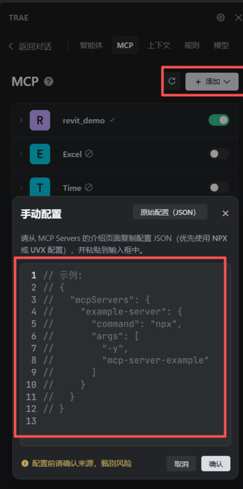

# Revit MCP DotNet Project

Language: [中文](README.zh-CN.md) | English

This project contains two main components: a Revit MCP (Mcp) server and a Revit Plugin to communicate with it.

## Revit MCP Project

The Revit MCP project (`NET.Mcp.Server`) is a .NET Core application that acts as a bridge between a main application and the Revit application. It listens for commands and executes them within the Revit environment.

### Configuration

The MCP server is configured via the `mcpConfig.json` file located in `src\NET.App.Revit\NET.Mcp.Server\`. This file defines how to launch the MCP server processes.

For example, to configure it for the `trae` environment, you would set the project path to your local machine's path.

**Example `mcpConfig.json`:**

```json
{
  "mcpServers": {
    "revit": {
      "command": "dotnet",
      "args": [
        "run",
        "--project",
        "d\\yourpath\\revit_mcp_dotnet_template\\src\\NET.App.Revit\\NET.Mcp.Server",
        "--no-build"
      ],
      "env": {}
    }
  }
}
```

**Note:** Make sure the `--project` path points to the correct location of the `NET.Mcp.Server` project on your machine.

### Running the Server

To run the MCP server, you can execute the command defined in your `mcpConfig.json` from your terminal. Based on the example above, you would run:

```bash
dotnet run --project d:\GitHub\revit_mcp_dotnet-main\src\NET.App.Revit\NET.Mcp.Server
```

This will start the server, which will then wait for the Revit plugin to connect.

## Revit Plugin Project

The Revit Plugin (`NET.App.Revit`) is an add-in for Autodesk Revit that connects to the MCP server and allows for external control of Revit.

### Usage in Revit

1.  **Build the Project**: Build the `NET.App.Revit.sln` solution to generate the plugin DLLs.
2.  **Load the Plugin in Revit**:
    *   Copy the generated `.addin` file and the associated DLLs to the Revit Add-ins folder (e.g., `%APPDATA%\Autodesk\Revit\Addins\2022`).
    *   Start Autodesk Revit.
3.  **Run the Plugin**:
    *   Once loaded, you will find new commands in the Add-ins tab in Revit.
    *   Use the "Start Server" command (or similar) to initiate the connection to the running MCP server.

### Version Compatibility

This plugin is currently configured and tested for **Revit 2022**.

If you need to use it with other versions of Revit (e.g., 2021, 2023, 2024), you will need to:
1.  Update the Revit API references in the `.csproj` file.
2.  Adjust the `.addin` file to target the desired Revit version.
3.  Rebuild the project.

## Examples Included

- MCP Server (.NET): Located at `src/NET.App.Revit/NET.Mcp.Server`. Includes a sample `mcpConfig.json` (with a Trae example) to launch the server locally.
- Revit Plugin (.NET): Located at `src/NET.App.Revit/NET.App.Revit`. Contains the add-in project and instructions to load it in Revit.

Both examples are implemented on the .NET side. The plugin is verified with Revit 2022; other versions require manual configuration of API references and the `.addin` target.

## Quick Links

- Detailed Revit app guide (English): `src/NET.App.Revit/README.md`
- 详细中文指南：`src/NET.App.Revit/README.zh-CN.md`

## Trae MCP Configuration

Below is where to paste the MCP config JSON in Trae. Toggle the server after adding it.



### How to Use `mcpConfig.json` in Trae

- Open Trae and go to the `MCP` tab.
- Click `+ Add` → select `Manual Config (JSON)`.
- Paste the JSON from your `mcpConfig.json` (see example above).
- Click `Confirm` and ensure the new server appears in the list.
- Toggle the server ON to start it.

### Start Project (Step-by-Step)

- Prerequisites: install `'.NET 8 SDK'` and `Revit 2022` (other versions need manual plugin config).
- Build plugin: open `src/NET.App.Revit/NET.App.Revit.sln`, build Release, copy the `.addin` and DLLs to `%APPDATA%\Autodesk\Revit\Addins\2022`.
- Start MCP Server (CLI): run `dotnet run --project d:\GitHub\revit_mcp_dotnet-main\src\NET.App.Revit\NET.Mcp.Server`.
- Start MCP Server (Trae): add the JSON via the MCP tab (as above) and toggle ON.
- Launch Revit: open Revit, the plugin appears under `Add-ins`. Use the command to connect to the running MCP server.
- Verify: execute a simple command via your MCP client or observe logs to confirm the Revit session is controlled.